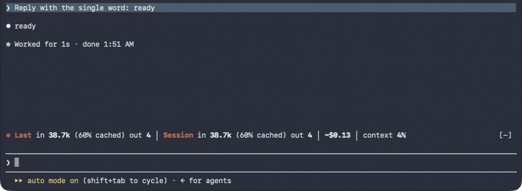
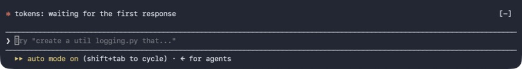

# Token Usage Line

A Claude Code mod that draws one line above the prompt:



```
✻ Last in 38.7k (60% cached) out 4 │ Session in 38.7k (60% cached) out 4 │ ~$0.13 │ context 4%
```

- **Last**: tokens of the most recent response, including the subagents it started.
- **Session**: running total since the session started (`/clear` resets it).
- **~$**: the session's cost so far, Claude Code's own estimate (the same figure `/cost` shows), from list prices; not what a Pro/Max plan bills.
- **context**: how full the context window is.
- **% cached**: share of input tokens served from the prompt cache, which are billed far cheaper.

Until the first response of a session finishes, the line says so instead of showing zeros:



Colours come from the active Claude Code theme, so it follows light and dark mode.

## Install

Requires Claude Code **2.1.292 or later** (it relies on the mods API; on 2.1.278 the line fails to draw). Check with `claude --version`, update with `claude update`.

```bash
claude plugin marketplace add mkiselyow/claude-code-token-usage
```

```bash
claude plugin install token-usage-line@token-usage-line
```

Start a new session and the line appears above the prompt.

Or try it for one session without installing:

```bash
git clone https://github.com/mkiselyow/claude-code-token-usage
```

```bash
claude --plugin-dir ./claude-code-token-usage
```

## Update

```bash
claude plugin marketplace update token-usage-line
```

```bash
claude plugin update token-usage-line@token-usage-line
```

## Uninstall

```bash
claude plugin uninstall token-usage-line@token-usage-line
```

```bash
claude plugin marketplace remove token-usage-line
```
